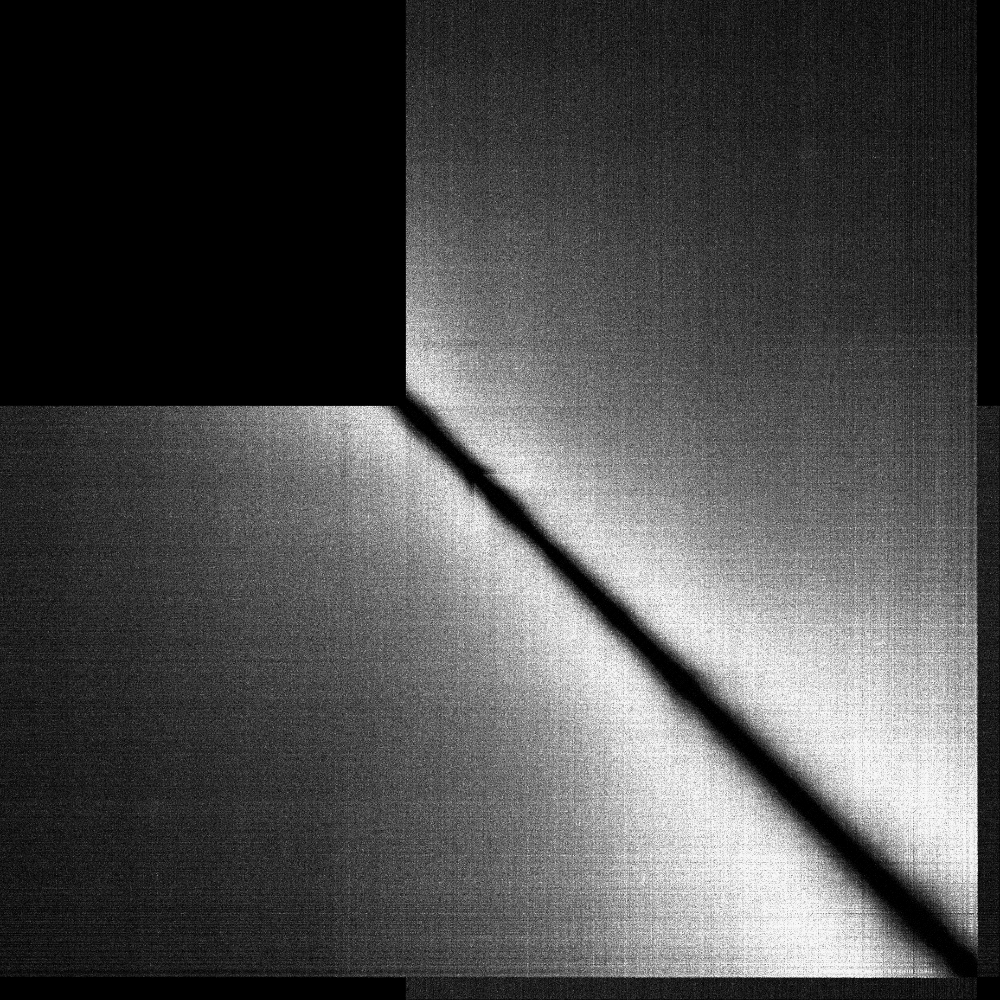
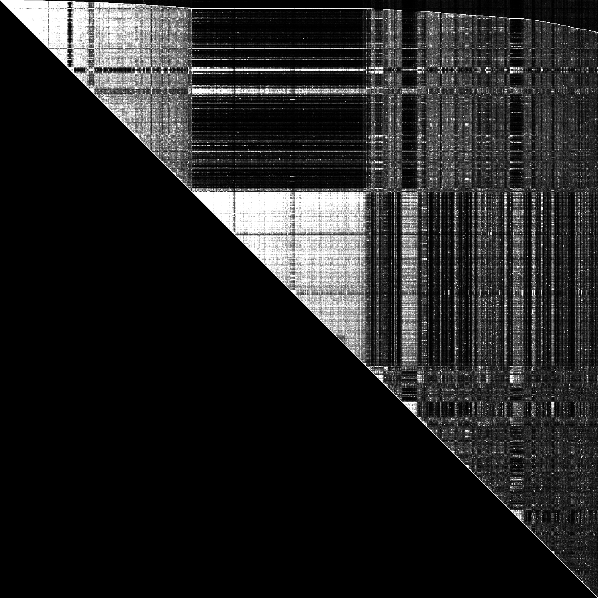
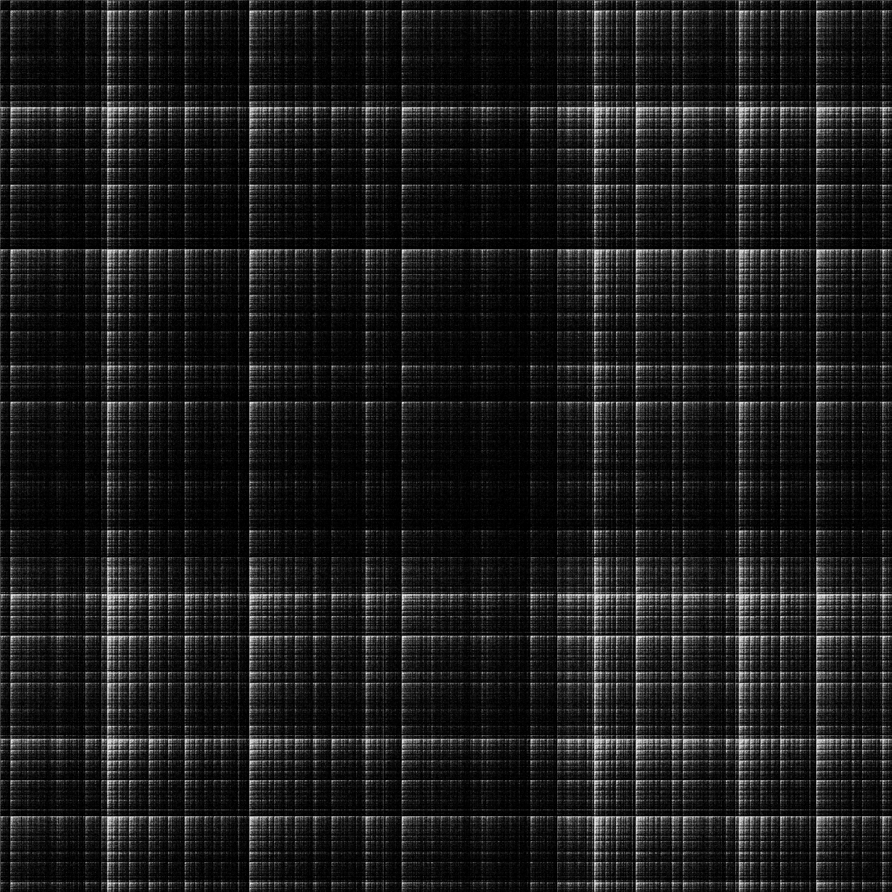

# Graph2Heatmap

Graph Heatmap Visualization

## Requirement

Linux, OpenCV

## Usage

```bash
./tsv2heatmap --input=./twitter_rv.net --output=$HOME/twitter_rv.png --grid-width=16384 --brightness-increment=2
```

## Example result (Natural Graph)

### cit-Patents (Undirected)



### com-orkut



## Example result (Synthetic Graph)

### graph500-scale18-ef16 (Undirected)



### graph500-scale20-ef16 (Undirected)


## Example result: twitter_rv.net (Brightness Increment)

```bash
./tsv2heatmap --input=./twitter_rv.net --output=$HOME/twitter_rv.png --grid-width=16384 --brightness-increment=1
```


```bash
./tsv2heatmap --input=./twitter_rv.net --output=$HOME/twitter_rv.png --grid-width=16384 --brightness-increment=2
```


```bash
./tsv2heatmap --input=./twitter_rv.net --output=$HOME/twitter_rv.png --grid-width=16384 --brightness-increment=4
```


```bash
./tsv2heatmap --input=./twitter_rv.net --output=$HOME/twitter_rv.png --grid-width=16384 --brightness-increment=8
```


```bash
./tsv2heatmap --input=./twitter_rv.net --output=$HOME/twitter_rv.png --grid-width=16384 --brightness-increment=16
```


