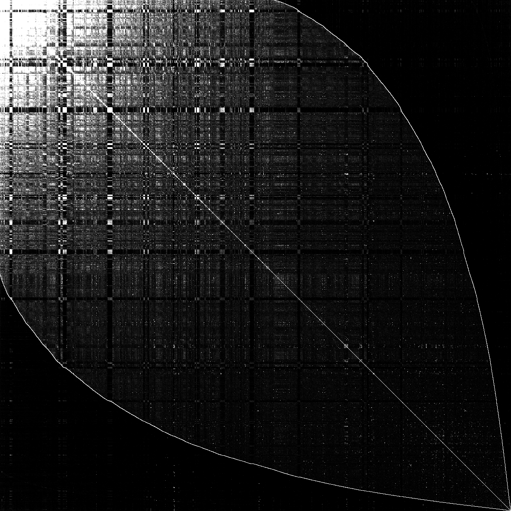

# Graph2Heatmap

Graph Heatmap Visualization

## Requirement

Linux, OpenCV

## Usage

```bash
./tsv2heatmap --input=./twitter_rv.net --output=$HOME/twitter_rv.png --grid-width=16384 --brightness-increment=2
```

## Example result (Natural Graph)

### soc-LiveJournal1



### cit-Patents (Undirected)


### com-orkut


## Example result (Synthetic Graph)

### graph500-scale18-ef16 (Undirected)


### graph500-scale20-ef16 (Undirected)


## Example result: twitter_rv.net (Brightness Increment)

### twitter_rv.net (brightness-increment = 1)


### twitter_rv.net (brightness-increment = 2)


### twitter_rv.net (brightness-increment = 4)


### twitter_rv.net (brightness-increment = 8)


### twitter_rv.net (brightness-increment = 16)


## Copyright

Copyright by Heeyong Yoon, DGIST, South Korea
